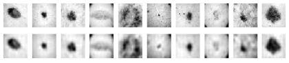
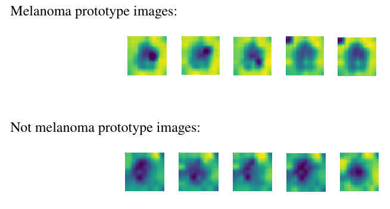
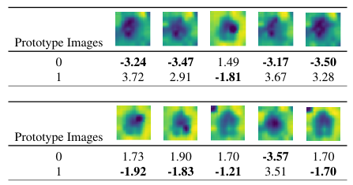
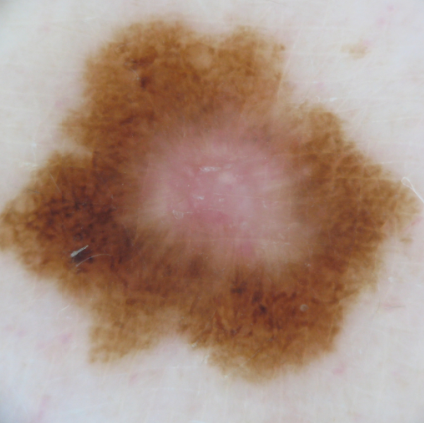
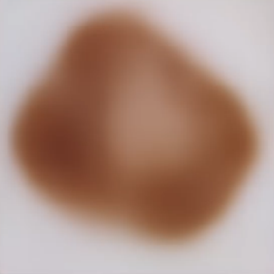
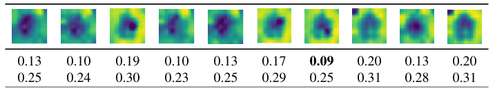
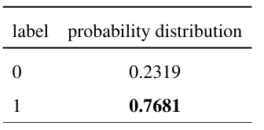

# Interpretable Prototype-Based Autoencoder for Melanoma Diagnosis  

This project presents an **interpretable deep learning model** for melanoma detection, combing **autoencoders** with **prototype-network**. The model realize transparency by visaulizing feature representations and prototype images and explain its decision-making by similarity calculating.

## Features  
- **Prototype-Based Autoencoder**: Combines autoencoder architecture with prototype learning for better interpretability.  
- **Feature Visualization**: Extracts and reconstructs key features, allowing insight into decision-making.  
- **Example-Based Explanations**: Uses prototype images to illustrate classification typical categories.  
- **Optimized Distance Strategies**: Implements multiple distance strategy (Euclidean, Manhattan, etc.) for improved performance and transparency.  
- **Dataset**: Designed for **melanoma detection** using the **ISIC2018 dataset**.  

## Model Architecture  
The model consists of:  
- **An Autoencoder Network**: Performs **feature extraction** and **reconstruction**.  
- **A Prototype Network**: Learns representative prototypes and classifies images based on similarity.  
- **Distance-Based Similarity Measures**: Optimizes classification and presentation using multiple distance strategies.  

## Dataset  
- **ISIC2018 Dataset**: 11,720 dermoscopic images  
- **Classes**: Melanoma (1,305 images) & Non-Melanoma (10,415 images)  
- **Preprocessing**: Image resizing, augmentation, and oversampling for class balance  

## Presentation

  

Original Images and Reconstructed images, the first row indicates original images, the second row indicate reconstructed images

  

The prototype images provide an intuitive visual reference to help understand the clustering and distribution of the model in the input space

  

The first row are the prototype images for the last epoch during training the model. The second and third rows are their weights for category 0 and 1(0 means not melanoma, 1 means melanoma)

## Instance

  

Melanoma original image

  

Melanoma decoder images

  

Distance between feature vectors and each prototype vector for above melanoma sample. The first row are prototype images. The second row are distances from prototype vectors to each input vector. The third row are distances from feature vectors to each prototype vector for the melanoma sample.
Can find that this instance has the nearist distance with the 7th prototypes which belongs to category melanoma.

  

The final classification result from the model.
